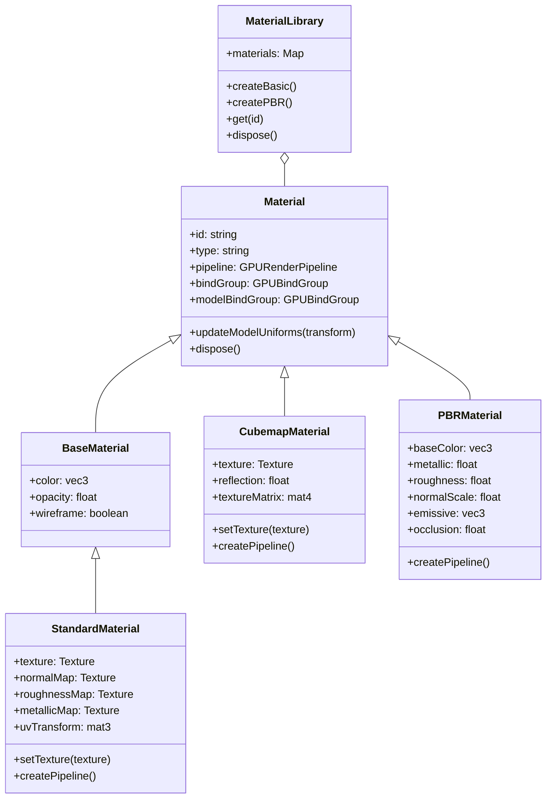
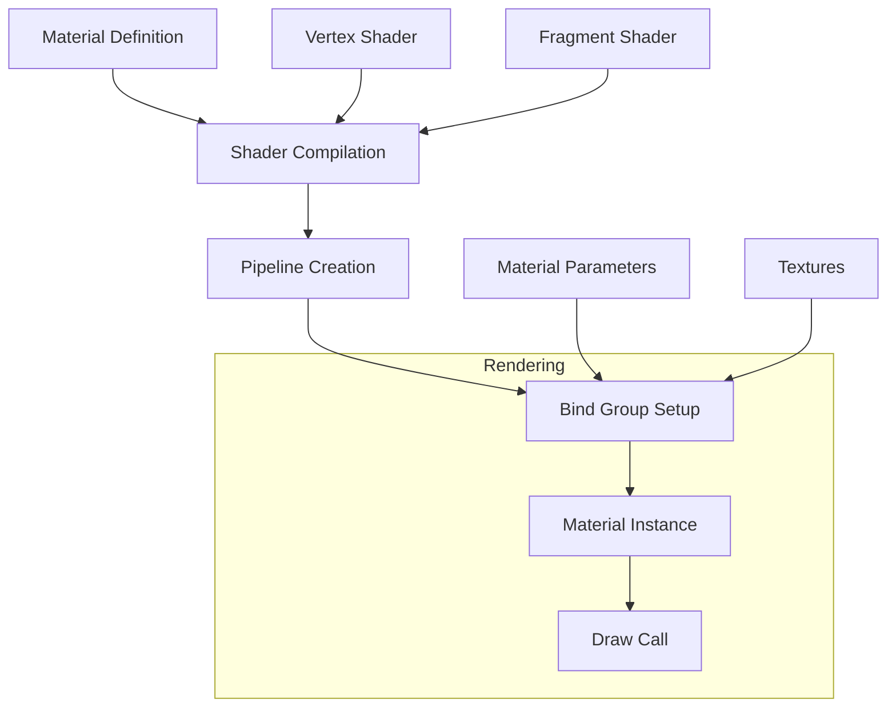

# Material System

## Overview
The material system in Shade Engine provides a flexible framework for representing surface properties and shader variations. Materials define how surfaces interact with light and other environmental factors, controlling visual appearance across the engine.

## Core Material Types

### Standard Material
The `StandardMaterial` provides physically-based rendering with standard UV texture mapping:
- **Albedo/Base Color**: Surface color or texture
- **Normal Mapping**: Surface detail without geometry
- **Roughness**: Micro-surface variation control
- **Metallic**: Metal vs. non-metal properties
- **Emissive**: Self-illumination properties
- **Opacity**: Transparency control

### Cubemap Material
The `CubemapMaterial` enables environment mapping using a single 2D texture projected as a cubemap:
- **Texture Projection**: Dynamic projection of 2D textures onto 3D surfaces
- **Environment Reflection**: Simulating reflective surfaces
- **Flexible Mapping**: Different projection modes for various effects

### PBR Material
The Physically-Based Rendering material provides realistic lighting across different lighting conditions:
- **Energy Conservation**: Physically accurate light interaction
- **Microfacet Theory**: Accurate microsurface modeling
- **Fresnel Effects**: View-dependent reflection
- **Specular vs. Metallic Workflows**: Support for both industry standards

### Specialized Materials
- **Terrain Material**: Multi-layer blending for landscape rendering
- **Skin Material**: Sub-surface scattering for organic surfaces
- **Cloth Material**: Anisotropic shading models for fabrics
- **Water Material**: Dynamic surface simulation and optical effects

## Architecture

## Shader Architecture
Materials integrate directly with the shader system, using WebGPU shader modules:

## Material Pipeline Integration

Materials encapsulate complete render pipeline states including:
- Shader modules for vertex and fragment stages
- Blend states for transparency
- Depth/stencil configuration
- Binding layouts for uniforms and textures
- Sampler configurations

## Uniform Buffer Layout

### Model Uniforms (Group 1, Binding 0)
