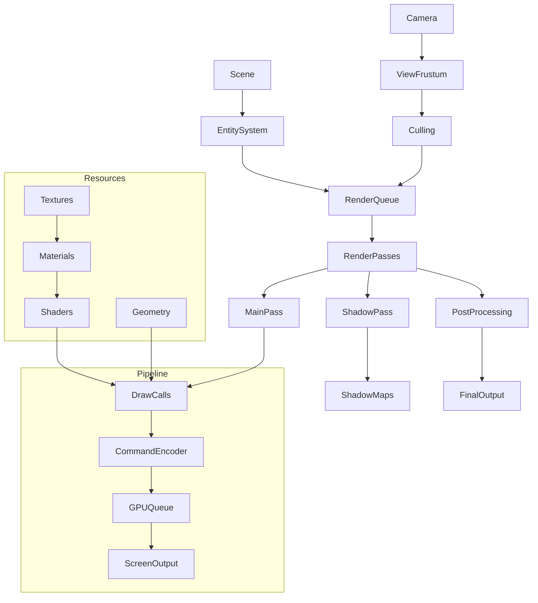
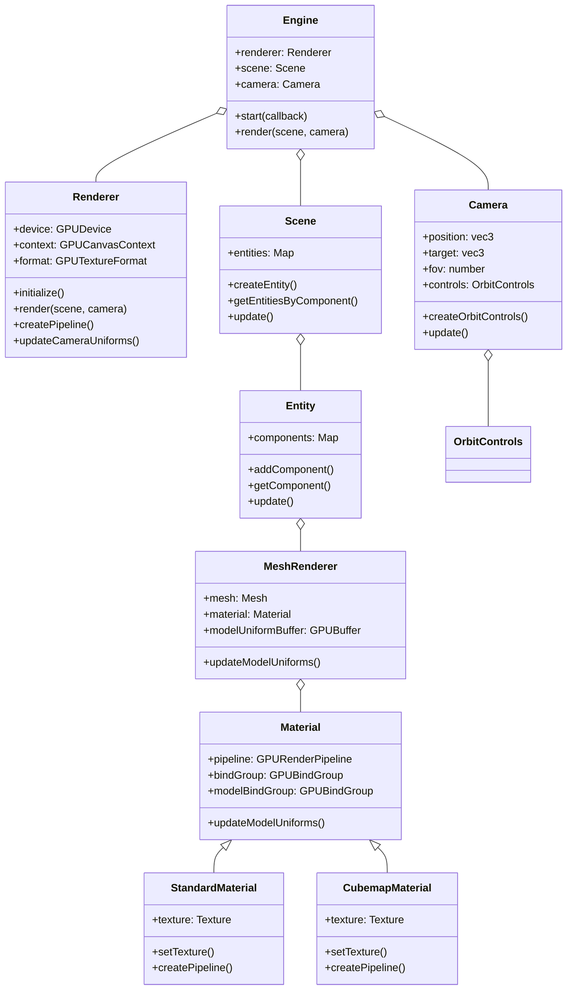
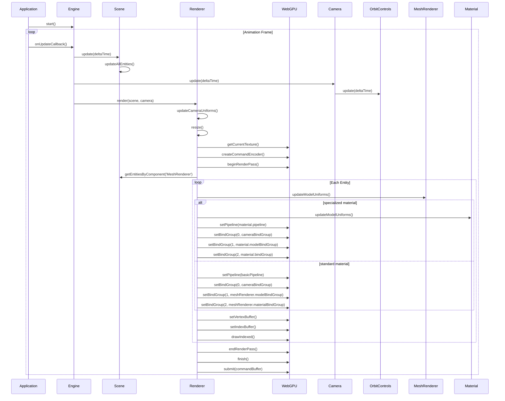
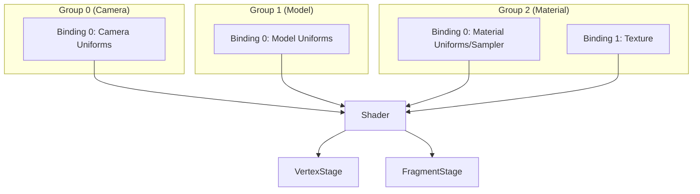
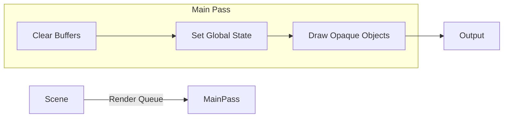
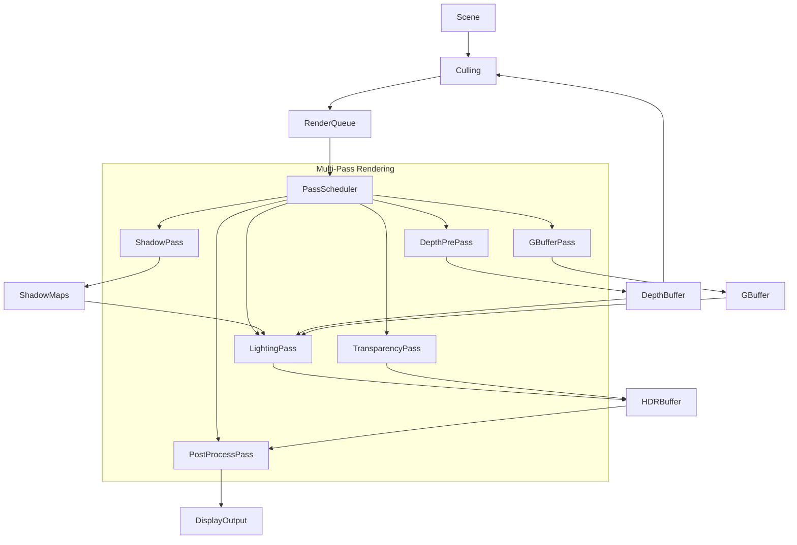
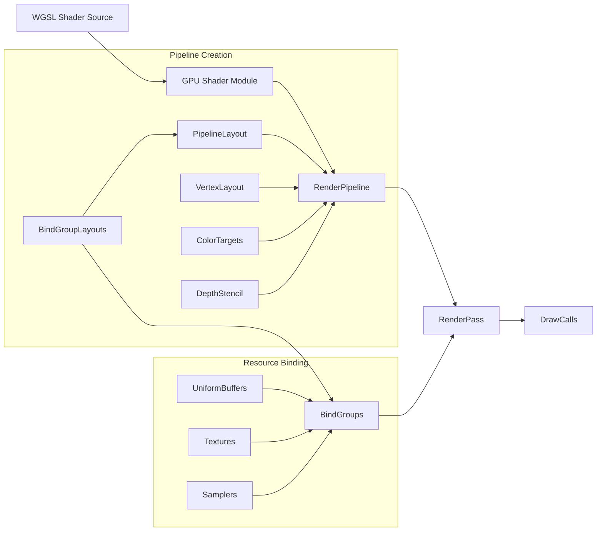

# Render Pipeline

## Overview
The Shade Engine render pipeline provides a flexible, high-performance system for rendering 3D graphics using WebGPU. The pipeline manages the complete rendering process from scene traversal to final output, with support for various rendering techniques and optimizations.

## Architecture Overview



**Explanation:**

- **Scene & Entity System**: The entry point containing all objects to be rendered. The ECS pattern organizes game objects as entities with renderable components.
- **Render Queue**: Objects are sorted and prioritized for rendering based on material type, depth, and other criteria to minimize state changes.
- **Render Passes**: Multiple distinct passes each with specific purposes:
  - **Main Pass**: Renders opaque and transparent geometry with lighting
  - **Shadow Pass**: Generates shadow maps for light sources
  - **Post-Processing**: Applies screen-space effects to the rendered scene
- **Culling Systems**: Uses the camera's view frustum to eliminate objects not visible to the camera, improving performance
- **Resource Management**: Materials, shaders, geometry and textures are prepared and uploaded to the GPU
- **Pipeline Execution**: WebGPU commands are encoded, submitted to the GPU queue, and executed to produce screen output

## Current Implementation



**Explanation:**

- **Engine**: Central manager that coordinates all systems and maintains the render loop
- **Renderer**: Handles the WebGPU setup, pipeline creation, and frame rendering
- **Scene**: Contains and organizes all renderable entities
- **Camera**: Defines the viewpoint for rendering with optional orbit controls
- **Entity**: A game object with components that define its behavior and appearance
- **MeshRenderer**: Component that combines mesh geometry with material for rendering
- **Material System**: Defines surface properties with specialized implementations:
  - **StandardMaterial**: Uses standard UV mapping for texturing
  - **CubemapMaterial**: Maps texture as a cubemap onto geometry surfaces
- **OrbitControls**: Camera controller providing intuitive mouse/touch navigation

## Render Pipeline Flow



**Explanation:**

1. **Animation Loop**: The engine starts a continuous loop with regular callbacks
2. **Scene & Camera Updates**: 
   - Updates all entity logic and animations 
   - Camera position/orientation gets updated if using controls
3. **Render Preparation**:
   - Camera view and projection matrices updated 
   - Canvas/viewport resized if needed
   - WebGPU texture and command encoder created
4. **Render Pass Setup**:
   - Begin a render pass with color and depth attachments
   - Configure viewport and scissor rect
5. **Entity Rendering Loop**:
   - For each entity with a MeshRenderer component:
     - Update model matrices and uniforms
     - Set appropriate pipeline and bind groups based on material type
     - Configure vertex/index buffers and draw the mesh
6. **Finalization**:
   - End render pass
   - Finish command encoding
   - Submit commands to GPU queue for execution

## Bind Group Layout



**Explanation:**

- **Group 0 (Camera)**:
  - Contains view and projection matrices combined into a single viewProjection matrix
  - Used by all shaders to transform vertices into clip space
  - Updated once per frame

- **Group 1 (Model)**:
  - Contains model matrix, rotation parameters, and animation time
  - Defines object position, scale, and orientation
  - Updated for each object being rendered

- **Group 2 (Material)**:
  - Material-specific data including textures and samplers
  - For standard materials: color, metallic, roughness properties
  - For cubemap materials: texture sampler and 2D texture
  - Different layout based on material type

The bind groups allow for efficient resource sharing: the camera bind group can be set once for all objects, while model and material bind groups change per-object.

## Render Pass Structure



**Explanation:**

- **Clear Buffers**: Reset color and depth buffers at the start of each frame
- **Set Global State**: Configure viewport, scissor rect, camera uniforms
- **Draw Opaque Objects**: Render all visible entities with their materials
- **Output**: Present the final rendered image to the screen

This simplified single-pass structure is our current implementation. Future enhancements will add specialized passes for shadows, post-processing, and transparent objects.

## Future Pipeline Extensions



**Explanation:**

- **Culling**: Advanced visibility testing to eliminate non-visible objects
- **Pass Scheduler**: Intelligently sequences render passes based on dependencies
- **Shadow Pass**: Renders scenes from light perspectives for shadow mapping
- **Depth Pre-Pass**: Early Z-pass to identify visible surfaces before full shading
- **G-Buffer Pass**: Deferred rendering approach storing surface data for later lighting
- **Lighting Pass**: Applies lighting calculations using depth, normals, and material data
- **Transparency Pass**: Handles translucent objects with proper sorting and blending
- **Post-Processing Pass**: Applies screen-space effects like bloom, tone mapping, and antialiasing
- **Intermediate Buffers**: Store partial results between passes:
  - **Shadow Maps**: Depth maps from light perspectives
  - **Depth Buffer**: Scene depth information
  - **G-Buffer**: Geometry attributes (normals, albedo, etc.)
  - **HDR Buffer**: High dynamic range lighting results

This multi-pass approach allows for advanced effects while maintaining performance through optimized pass dependencies.

## Shader Compilation Process



**Explanation:**

1. **Shader Compilation**:
   - WGSL shader source code is loaded and compiled into a GPU shader module
   - Vertex and fragment shader entry points are specified

2. **Pipeline Configuration**:
   - **Bind Group Layouts**: Define expected resource types and bindings
   - **Pipeline Layout**: Organizes bind group layouts into ordered groups
   - **Vertex Layout**: Defines vertex buffer formats and attribute locations
   - **Color Targets**: Specifies output formats and blend states
   - **Depth Stencil**: Configures depth testing and writing behavior

3. **Resource Preparation**:
   - **Uniform Buffers**: Hold shader uniform data (matrices, parameters)
   - **Textures**: Image data for materials
   - **Samplers**: Define texture filtering and addressing modes
   - **Bind Groups**: Connect GPU resources to specific binding points

4. **Rendering**:
   - Set active pipeline in render pass
   - Set appropriate bind groups
   - Issue draw calls with vertex/index buffers

This process creates efficient GPU-resident pipelines that can be quickly switched during rendering.

## API Usage

### Rendering Setup
```javascript
// Initialize rendering
const engine = new Engine({
  canvas: document.getElementById('canvas'),
  debug: true
});

await engine.initialize();

// Create scene, camera and entities
const scene = engine.createScene();
const camera = engine.createCamera({
  position: [0, 1, 5],
  target: [0, 0, 0],
  fov: 60
});

// Add orbit controls
const controls = camera.createOrbitControls({
  enableDamping: true,
  dampingFactor: 0.05
});

// Create entities with materials
const entity = scene.createEntity();
entity.addComponent('Transform', { position: [0, 0, 0] });
entity.addComponent('MeshRenderer', {
  mesh: engine.primitives.createBox(),
  material: new StandardMaterial(engine, { texture: texture })
});

// Start render loop
engine.start((time, deltaTime) => {
  camera.update(deltaTime);
  engine.render(scene, camera);
});
```

## Performance Optimizations

The Shade Engine render pipeline incorporates several performance optimizations:

- **Frustum Culling**: Skip rendering objects outside the camera's view
- **Pipeline State Sorting**: Minimize state changes between draw calls
- **Batch Processing**: Group similar objects for efficient rendering
- **Asynchronous Resource Loading**: Non-blocking texture and mesh loading
- **Dynamic LOD**: Level of detail based on distance and screen size

## Future Directions

The render pipeline is being extended with these features:

- **Compute Shader Integration**: GPU-accelerated processing
- **Clustered Forward Rendering**: Efficient light management
- **Indirect Drawing**: GPU-driven draw calls
- **Visibility Buffer**: Deferred shading with minimal memory usage
- **Adaptive Resolution**: Dynamic render resolution based on performance
